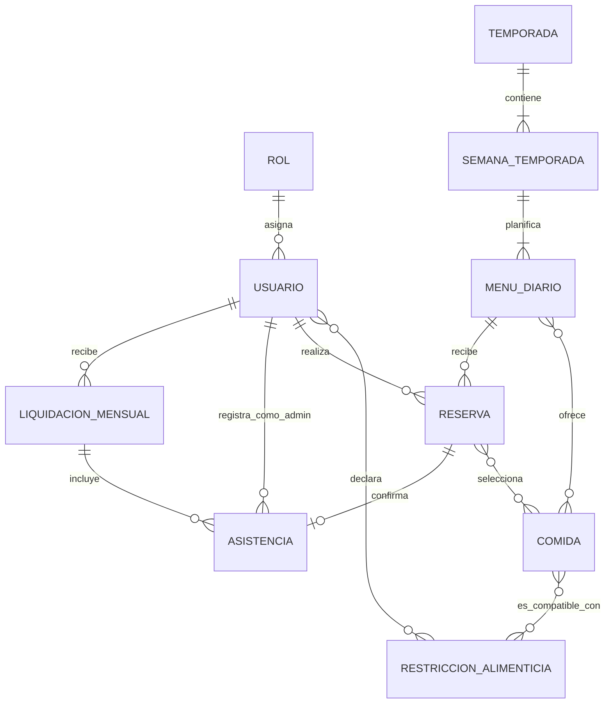

# Modelo de entidades y relaciones

Este modelo conceptual se deriva de [`spec.md`](./spec.md). Las decisiones que la especificación todavía no define se indican al final y deben resolverse antes de convertir definitivamente el modelo en tablas.



## Relaciones 1-N

| Relación | Cardinalidad | Interpretación |
|---|---:|---|
| Rol → Usuario | 1-N | Un rol puede estar asignado a muchos usuarios; cada usuario tiene un rol. |
| Temporada → Semana de temporada | 1-N | Una temporada contiene exactamente cuatro semanas. |
| Semana de temporada → Menú diario | 1-N | Una semana contiene los menús correspondientes a sus días. |
| Usuario → Reserva | 1-N | Una persona puede realizar muchas reservas en fechas diferentes. |
| Menú diario → Reserva | 1-N | Un menú puede ser reservado por muchas personas. |
| Usuario administrador → Asistencia | 1-N | Un administrador puede registrar muchas asistencias. |
| Usuario → Liquidación mensual | 1-N | Una persona puede tener una liquidación por cada período mensual. |
| Liquidación mensual → Asistencia | 1-N | Una liquidación incluye las asistencias confirmadas de esa persona y período. |

Restricciones adicionales:

- `Reserva → Asistencia` es **1 a 0..1**: una reserva activa puede no tener todavía asistencia, pero nunca puede tener más de una.
- `Temporada → Semana de temporada` es conceptualmente 1-N, con la restricción de que deben existir **exactamente cuatro semanas**.
- Debe existir una restricción única sobre la combinación `Reserva(usuario, fecha)`, porque una persona solo puede reservar una vez por día.

## Relaciones N-N

Las relaciones N-N se convierten posteriormente en tablas intermedias:

| Relación N-N | Tabla intermedia propuesta | Motivo |
|---|---|---|
| Usuario ↔ Restricción alimenticia | `usuario_restriccion` | Una persona puede declarar varias restricciones y una restricción puede corresponder a muchas personas. |
| Comida ↔ Restricción alimenticia | `comida_restriccion_compatible` | Una comida puede ser compatible con varias restricciones y viceversa. |
| Menú diario ↔ Comida | `menu_comida` | Un menú ofrece varias comidas y una comida puede reutilizarse en distintos menús. |
| Reserva ↔ Comida | `reserva_comida` | Una reserva selecciona varias comidas y una comida puede estar incluida en muchas reservas. |

## Vista orientada a tablas

```text
ROL 1 ─────────── N USUARIO
                       │
                       ├──── N USUARIO_RESTRICCION N ──── 1 RESTRICCION_ALIMENTICIA
                       │
                       ├──── 1 ──────────────────────── N RESERVA
                       │                                    │
                       │                                    ├── N RESERVA_COMIDA N ── 1 COMIDA
                       │                                    │                         │
                       │                                    │                         └── N COMIDA_RESTRICCION N ── 1 RESTRICCION_ALIMENTICIA
                       │                                    │
                       │                                    └── 1 ─── 0..1 ASISTENCIA
                       │                                                   │
                       ├──── 1 ─────────────────────────── N ┘ registrada_por
                       │
                       └──── 1 ─────────────────────────── N LIQUIDACION_MENSUAL
                                                                   │
                                                                   └──── 1 ─── N ASISTENCIA

TEMPORADA 1 ─── N SEMANA_TEMPORADA 1 ─── N MENU_DIARIO
                                                   │
                                                   ├── N MENU_COMIDA N ── 1 COMIDA
                                                   │
                                                   └── 1 ─────────────── N RESERVA
```

## Campos mínimos sugeridos

- `Usuario`: id, correo, hash de contraseña, tipo de usuario, rol y estado.
- `Rol`: id y nombre.
- `RestriccionAlimenticia`: id, nombre y descripción.
- `Comida`: id, nombre, tipo (`ENTRADA`, `PLATO_PRINCIPAL`, `POSTRE` o `BEBIDA`) y estado.
- `Temporada`: id, nombre, estación, fecha desde, fecha hasta y estado.
- `SemanaTemporada`: id, temporada y número de semana (1-4).
- `MenuDiario`: id, semana y día de la semana o fecha aplicable.
- `Reserva`: id, código único, usuario, menú, fecha, estado y fecha de creación.
- `ReservaComida`: reserva y comida.
- `Asistencia`: id, reserva, administrador que confirmó y fecha y hora.
- `LiquidacionMensual`: id, usuario, año, mes, importe total y fecha de generación.

## Decisiones de modelado resueltas

La sección 3 de [`spec.md`](./spec.md) establece que:

1. Cada usuario tiene exactamente un rol.
2. `Menú diario` es una plantilla por día de la semana dentro del ciclo de una temporada.
3. La liquidación mensual es individual por usuario, año y mes.
